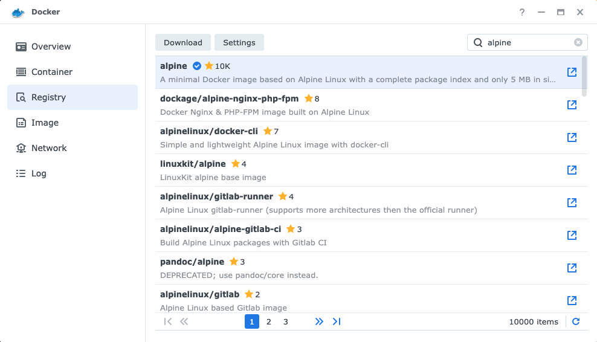

I got a new Synology DS220+ NAS a few weeks ago. It's meant to replace an older Ubuntu Linux PC that I used as a Plex server and a general utility box. One of the things my old machine did was run an automated [Speedtest](https://www.speedtest.net/) every 15 minutes, saving the results to disk.

Disclaimer: I know very little about Synology, DSM, Docker, Linux, or shell programming. I'm just a web developer who likes to tinker with things.

Anyway, here's what I did to set up an automated Speedtest on my Synology NAS using the [Speedtest CLI](https://www.speedtest.net/apps/cli), Docker, and the Scheduled Tasks tool.

## Prerequisites

The following assumptions are made for this guide. If you need help with any of these, there are plenty of articles out there that do a far better job than I could.

- You have _Docker_ installed via _Package Manager_.
- You have _SSH_ enabled on your Synology NAS.
- You are comfortable in the _Terminal_ app of your choice.

## Create a folder for the Docker container to mount

Open _File Station_. Click `Create` / `Create Shared Folder` to create a new shared folder. Name it `speedtest-cli`. Click _Next_ a few times, then click _Apply_ to create the folder. All of the default options are fine.


## Create a Docker container

There are several Docker containers out there that will run the Speedtest CLI, but none of them do exactly what I want. For my purposes, we will create a basic `alpine` container and install Speedtest CLI manually.

In Docker, select _Registry_ on the left, then search for `alpine`. Select the most popular one and click `Download`. The default tag of `latest` is fine.



Once it's downloaded, the image will show up under _Image_ on the left.


Select _Container_ on the left, then _Create_. Select `alpine:latest` and click _Next_.

The default network settings are fine. Click _Next_.

In _General Settings_, name the container `speedtest-cli`, check `Enable auto-restart`, then click _Next_.


No _Port Settings_ are required, so click _Next_.

In _Volume Settings_, click _Add Folder_ and select the `/speedtest-cli` folder you created earlier. For _Mount Path_ enter `/root`. This will map the `/root` folder inside the container to `/docker/speedtest-cli`.


Click _Next_ then _Done_ to start the container.


## Install the Speedtest CLI

Using Terminal on your computer, SSH into your NAS. You'll need your password. Change `username` to your username and change `192.168.0.0` to the address of your NAS.

```
ssh username@192.168.0.0
```
Then SSH into your Docker container. You'll need your password again.

```
sudo docker exec -ti speedtest-cli /bin/sh
```

Note: Much of the following is adapted from [this gist](https://github.com/vgist/dockerfiles/blob/master/speedtest-cli/Dockerfile).

Install some prerequisites with `apk`. The `tar` and `curl` packages are used to download the Speedtest CLI. The `bash` package will be used to run it after it's installed.

```
apk add --no-cache tar curl bash
```

Go to the [Speedtest CLI](https://www.speedtest.net/apps/cli) website, scroll down, and expand the _Download for Linux_ button. The DS220+ has an Intel Celeron, so copy the link for the `x86_64` file. The link will look something like this:

```
https://install.speedtest.net/app/cli/ookla-speedtest-1.2.0-linux-x86_64.tgz
```

Back in Terminal, run the following commands to install the Speedtest CLI. Don't forget to replace `[link you copied above]` with the actual link.

```
cd /tmp
curl -sSL [link you copied above] | tar xz
mv /tmp/speedtest /usr/local/bin/
rm -rf /tmp/speedtest.*
```

Now you can remove the packages you don't need anymore.

```
apk del curl tar
```

## Try running a Speedtest

```
speedtest --accept-license --accept-gdpr
```

You should see a Speedtest running, showing among other things, your _Latency_, _Download_, _Upload_, and _Packet Loss_, with a _Result URL_ at the end. It should take around 30 seconds to complete.

Note that the `--accept-license` and `--accept-gdpr` options will automatically accept both of these agreements. If you prefer to do that manually, remove those options.

## Save the Speedtest results to a file

Now that the Speedtest CLI is working, let's save the output to disk. Here's a little script I wrote that saves the result as a timestamped JSON file inside a folder named for the current month. Using the text editor of your choice, save this as `run.sh` in the `speedtest-cli` shared folder on the NAS.

```
#/bin/bash

path="/root/results"
foldername=`date +"%Y-%m"`
filename=`date +"%s"`
results="${path}/${foldername}/speedtest-${filename}.json"
mkdir -p "${path}/${foldername}"
/usr/local/bin/speedtest --accept-license --accept-gdpr -f json > "${results}"
```

If you prefer something other than JSON, the Speedtest CLI also supports `tsv`, `csv`, `jsonl`, and `json-pretty`. There are a bunch of other options, too, like manual server selection. Run `speedtest --help` when logged into the Docker container for a full list.

Give the script a try. Run the following commands inside the container.

```
cd /root
./run.sh
```

After 30 seconds or so, your prompt should return and you should see a new folder in `/root/results` named something like `2023-02`. Inside that folder you should see a file with a name like `speedtest-1676073601.json`. If you check out the contents of that file, you should see your Speedtest result.

```
{"type":"result","timestamp":"2023-02-11T00:00:26Z","ping":{"jitter":...
```

## Automate the script

Now it's time to automate the this script. On your NAS, open _Control Panel_ and then _Task Scheduler_ near the bottom. Click _Create_ / _Scheduled Task_ / _User-defined script_. Name your task `speedtest-cli` and change the user to `root`.


Under the _Schedule_ tab, select the frequency you'd like to run. I chose `Daily`, a _Frequency_ of `Every 15 minutes`, _First run time_ of `00`, and _Last run time_ of `23:45`.


Under the _Task Settings_ tab, enter the following under _User-defined script_.

```
docker exec speedtest-cli bash /root/run.sh
```

This runs the `run.sh` script inside the docker container, which will run a Speedtest and output the results as a new JSON file.


Click `OK`, accept the warning about running a task as `root`, and wait for the next quarter-hour mark. About 30 seconds after the quarter-hour, you should see a new JSON file alongside the one you generated before. Nice work!


Be aware that a Speedtest can use a few hundred megabytes of bandwidth. If you have a metered connection you might want to reconsider how often you run this task.

## Conclusion

Now that this is set up, what should you do with all these JSON files? I don't know! Maybe make a chart or something. I guess that will be the topic of a new article.
